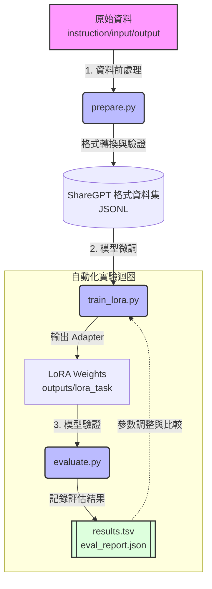

# DND-like Model: LoRA 自動化微調框架

本專案提供一套針對大型語言模型 (LLM) 進行 **多任務 QLoRA 微調** 的自動化實驗框架，專為文本遊戲 (TRPG / LitRPG) 開發所設計。
本框架能夠在消費級顯示卡 (如 RTX 3060 12GB) 上順暢執行，並整合了資料前處理、自動化訓練迴圈與模型評估流程。

---

## 🏗️ 系統架構與流程圖

本專案將微調工作拆分為三大核心自動化工具：`prepare.py`、`train_lora.py` 以及 `evaluate.py`。



---

## 🛠️ 自動化工具介紹

本專案的核心由三個 Python 腳本組成，涵蓋了從資料準備到模型評估的完整生命週期。

### 1. 資料前處理 (`prepare.py`)
負責將不同來源的資料集標準化為 ShareGPT 格式，並自動進行切分與驗證。
- **功能**：
  - 將自定義的 instruction/input/output 格式轉換為系統認可的對話格式 (ShareGPT)。
  - 自動進行 90/10 的 Training/Validation 分割 (Seed: 1234)。
  - 執行資料驗證，統計 Token 長度分佈，確保沒有破壞 Token 限制 (1024 tokens) 的過長條目。
- **使用方式**：
  ```bash
  python prepare.py
  ```

### 2. 模型微調與實驗 (`train_lora.py`)
這是自動化實驗的核心，支援多任務動態配置，並輸出結構化日誌供後續解析。
- **功能**：
  - 自動載入 4-bit 量化的 Base Model (Qwen 2.5 7B) 與指定的資料集。
  - 支援命令列參數 (CLI) 快速覆寫超參數 (Rank, Alpha, Learning Rate, Epochs)。
  - 提供快速實驗模式 (`--max-steps`)，便於在 5 分鐘內驗證一組參數。
  - 訓練完成後，自動將結果附加至 `results.tsv` 以利追蹤歷史紀錄。
- **使用方式**：
  ```bash
  # 正式訓練 (以 analyst 任務為例)
  python train_lora.py --task analyst

  # 快速參數搜尋 (僅跑 75 步測試)
  python train_lora.py --task analyst --max-steps 75 --rank 32 --alpha 64
  ```

### 3. 模型評估與測試 (`evaluate.py`)
用於評估已訓練好的 LoRA Adapter 的品質，避免模型退化。
- **功能**：
  - 在驗證集上計算模型的 Perplexity (困惑度) 與 Average Loss。
  - 執行**次要品質檢查**：
    - `analyst`: 檢查輸出的 JSON 解析成功率。
    - `translator`: 生成雙語對照樣本供人工檢閱。
    - `storyteller`: 生成故事接龍範例檢查文風。
  - 綜合生成 `eval_report.json` 與純文字報告。
- **使用方式**：
  ```bash
  python evaluate.py --task analyst
  ```

---

## 🚀 實驗參數參考

針對不同的任務，系統中定義了數組預設的超參數配置 (`TASK_PRESETS`)。您可以直接在 `train_lora.py` 中透過命令列參數覆寫它們：

| 任務 (Task) | 預設 Rank | 預設 Alpha | 預設 Learning Rate | 說明與適用情境 |
| :--- | :--- | :--- | :--- | :--- |
| `analyst` | 16 | 32 | 3e-4 | **實體抓取/JSON輸出**: 任務明確，使用較高的學習率與較小的 Rank。 |
| `translator` | 64 | 128 | 1e-4 | **翻譯**: 需要大範圍的跨語言映射，需要極高的 Rank 空間。 |
| `storyteller` | 32 | 64 | 2e-5 | **故事生成**: 風格對齊需要較低的學習率避免破壞模型原本的語法能力。 |

---

## 💻 本地環境限制 (以 RTX 3060 12GB 為例)

為了在 12GB VRAM 的環境中順暢運行，請注意以下資源管理原則：
1. **OOM 處理優先級**：若發生 Out of Memory，請依序：降低 `--max-seq-len` (例如降至 512) ➔ 降低 `--batch-size` (降為 1) ➔ 降低 `--rank`。
2. **Global Batch Size**：預設採用 `batch_size=2` 與 `grad_accum=4` 以達成等效 Batch Size = 8。 

如果您對訓練的進展感到滿意，可以前往 `outputs/lora_{task}/` 資料夾取得您的 LoRA 權重，並將其動態掛載至您的推理伺服器 (如 vLLM) 中。
